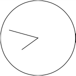
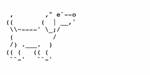
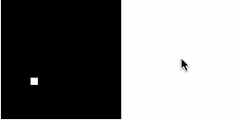

# Tweet-Sized Apps

To sharpen my skill at JavaScript minification, I occasionally write apps whose entire source fits in a tweet. The best approach for most of these is to adopt the style of Atari 2600 games but a lot more like Pong—using black and white. In effort to expand this collection, I’ll curate apps made by others as well.

To try these yourself, fire up a new [CodePen demo](https://codepen.io/pen) and paste the code in the HTML pane. Just so you know, the ones I wrote (without author) are never done; I’m always in search of ways to cut off more bytes and even open room for more features!

**Jump to…**

* [Analog Clock Widget](#analog-clock-widget)
* [Doodle Jump](#doodle-jump)
* [Endless Dog](#endless-dog)
* [Flappy Bird](#flappy-bird)
* [Tron](#tron)

<a name="analog-clock-widget"></a>
## Analog Clock Widget


Bytes: **279**

A minimalistic UTC clock consisting of a circle and lines for the hands

### Code
```
<body onload=c=c.getContext('2d');setInterval("d=Date.now();c.clearRect(0,0,w=150,w);c.beginPath();c.arc(w/=2,w,w,0,6.3);c.moveTo(w+Math.sin(h=d/36e5%24*.524)*40,w-Math.cos(h)*40);c.lineTo(w,w);c.lineTo(w+Math.sin(m=d/6e4%60*.105)*60,w-Math.cos(m)*60);c.stroke()",8)><canvas id=c
```

<a name="doodle-jump"></a>
## Doodle Jump


Bytes: **275**

So far, we have room for controlling the character and his ability to jump off platforms. Exiting at one side of the screen to end up on the opposite also works. There’s currently no scoring or progression, and passing the top of the screen results in ending up at the bottom.

🕹 J - move left, K -  move right

### Code
```
<body onkeyup=x+=event.which%2?9:-9 onload="c=C.getContext('2d');a=0;P=[x=63,9,y=99,x];setInterval(`a+=.01;y+=y<0?108:a;c.fillRect(0,0,W=144,W);for(p in P)l=p*36,d=P[p],a=y>l&&y<l+4&&x+8>d&&x<d+20?-1:a,c.clearRect(d,l,20,4);c.clearRect(x=x?x>W?9:x:W,y,8,-8)`,7)"><canvas id=C
```

<a name="endless-dog"></a>
## Endless Dog


Bytes: **274**

It’s like [endless.horse](http://endless.horse), but it’s a dog.

🕹 Hover - grow

### Code
```
<pre id=a onmousemove="b=[],a.innerHTML.split('\n').forEach((e,i)=>{d=e.split(''),d.splice(7,0,i==2?'-':i==4?'_':' '),b[i]=d.join('')}),a.innerHTML=b.join('\n')">
  ,        ," e`--o
 ((       (  | __,'
  \\~----' \_;/
  (          /
  /) .___.  )
 (( (   (( (
  ``-'   ``-'
```

<a name="flappy-bird"></a>
## Flappy Bird


Bytes: **277**

The core game functionalty is mostly there, but few limits remain: one pipe at a time and same vertical pipe positions.

🕹 Click/tap - flap

### Code
```
<body id=B onload="c=C.getContext('2d');o=[90,-92,98];y=0;x=225;s=0;setInterval('c.fillRect(0,0,W=150,W);for(i in o)c.clearRect(+i?x:37,o[i],+i?14:9,+i?W:9);b=o[0];b<W-9&&(x<23||x>46||58<b&&b<89)?(y+=.04,x<-13?(x=W,++s):--x,o[0]+=y):B.innerHTML=s',9)"><canvas id=C onclick=y=-1
```

<a name="tron"></a>
## Tron


Author: [Alok Menghrajani](https://www.quaxio.com/tron/)

Bytes: **219**

This one is where my inspiration came from for the others on here. It surfaced on Twitter when the expanded character limit was introduced.

🕹 I - up, J - left, K - down, L - right

### Code
```
<body id=b onkeyup=e=event onload=z=c.getContext('2d');z.fillRect(s=0,0,n=150,x=11325);setInterval("0<x%n&x<n*n&(z[x+=[1,-n,-1,n][e.which&3]]^=1)?z.clearRect(x%n,x/n,1,1,s++):b.innerHTML='game�over:'+s",9)><canvas id=c>
```
